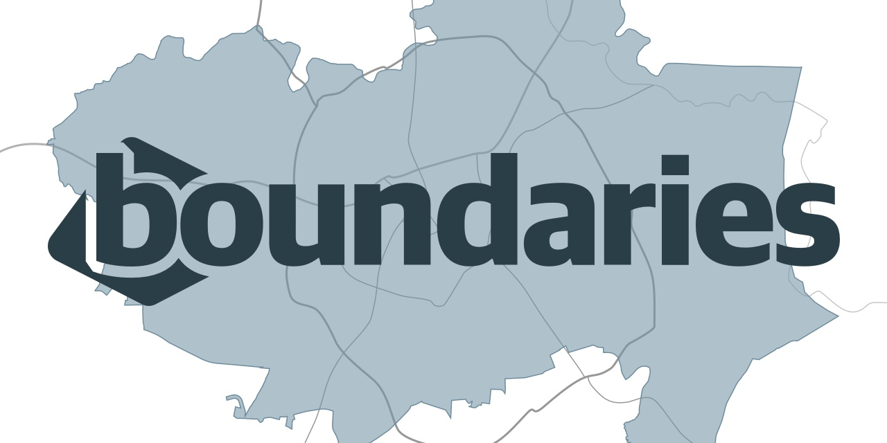

  

Bitmode Boundaries is an API for querying and retrieving GeoJSON for US administrative or common boundaries like:

* Cities
* Zip codes
* Counties
* State
* Neighborhoods

Data is sourced from US Census TIGER data—yielding up-to-date information on the census-defined geographies converted from Shapefile format.

### Looking for a hosted version?

We've got you. Head over to [boundaries.io](https://boundaries.io/?utm_source=gh&utm_content=readme#pricing) to see our pricing for access to a much faster API with the most up-to-date dataset. You can try it out for free.

You can query the boundaries.io API for to retrieve GeoJSON features to display in the mapping library of your choice. [Check out the docs](https://boundaries.io/docs?utm_source=gh&utm_content=readme) for more information.

